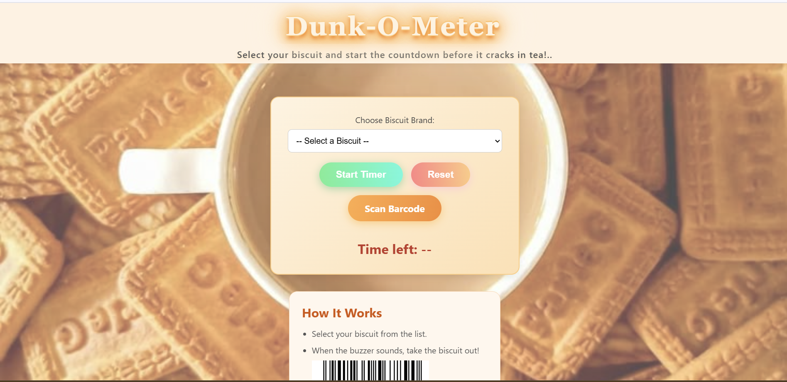
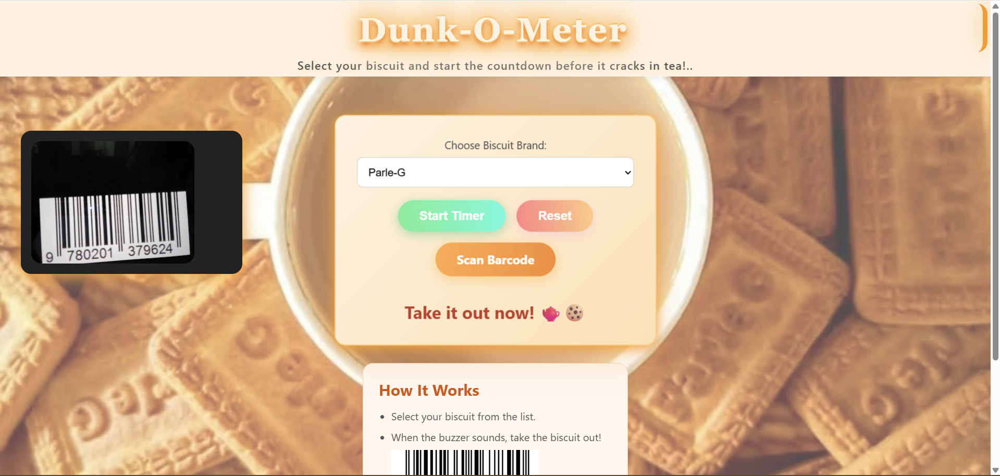
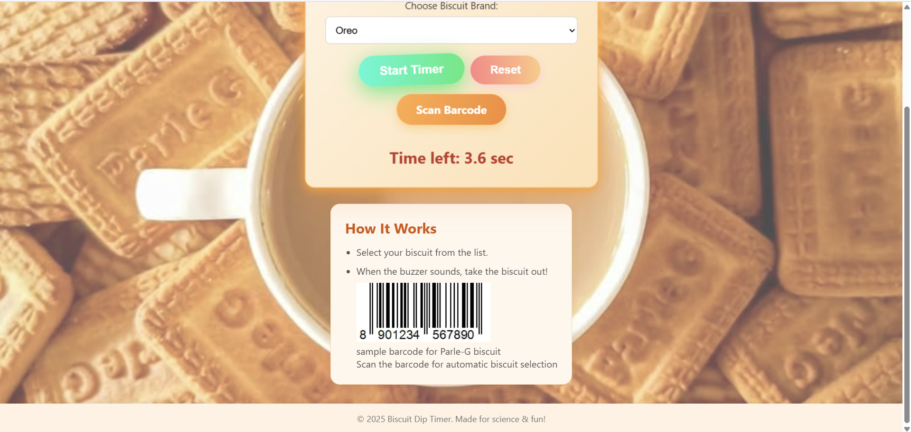

# Dunk-O-Meter🎯


## Basic Details
### Team Name: Tesla 💻


### Team Members
- Member 1: ABHISHEK V - GEC IDUKKI
- Member 2: AKHILRAJ KP - GEC IDUKKI

### Project Description
A fun, browser-based biscuit monitoring app that alerts you with a buzzer sound right before your biscuit dissolves into tea saving you from messy crumbs and heartache.

### The Problem (that doesn't exist)
Every tea lover knows the pain.  
- You dip... you chat... you forget...  
- ☠️ **Biscuit Collapse**  
- ☕ Crumb Soup  
- 💔 Emotional Damage 

### The Solution (that nobody asked for)

We present the **Biscuit Dip Timer™**:  
- 📷 Scans biscuit packet barcode with your camera  
- 📚 Fetches *exact* dip time from our elite **Biscuit Crack Time Database**  
- ⏳ Starts a countdown with dramatic animations  
- 🚨 Plays a buzzer right before disaster  

## Technical Details
### Technologies/Components Used
### 🖥 Software:  
- **Languages:** HTML, CSS, JavaScript  
- **Libraries:** QuaggaJS (barcode scanning), Anime.js (animations), Howler.js (sound)  
- **Tools:** VS Code, GitHub, Chrome DevTools, Canva  

### 🔌 Hardware:  
- (None. Just your browser and a working camera. Even your fridge biscuit stash is safe.)

---

### Implementation
For Software:
# Installation

```bash
git clone https://github.com/your-repo/Dunk-O-Meter.git
cd Dunk-O-Meter
# Run

open index.html
Or host it with GitHub Pages for instant tea-time deployment.
```
### Project Documentation
For Software:

# Screenshots (Add at least 3)

*Add caption explaining what this shows*


*Add caption explaining what this shows*


*Add caption explaining what this shows*

# Diagrams

*From Dip to Delight – Biscuit Rescue MissionFrom Dip to Delight – Biscuit Rescue Mission*

### Project Demo
# Video
[https://drive.google.com/file/d/1PqKnkMVXd-B2xw8C--KFPRQrsFRemxPh/view?usp=sharing]
*This video shows the Biscuit Dip Timer in action — scanning the biscuit packet, detecting its brand, starting the countdown, and sounding the buzzer just in time to save it from drowning in tea*


## Team Contributions
- ABHISHEK V: UI/UX, HTML
- AKHILRAJ KP: CSS , JAVASCRIPT

---

      ┌──────────────┐
      │ DIP WISELY!  │
      │ SAVE BISCUIT │
      └──────────────┘
         \  🍪  /
          \ ☕ /
           \_/

Made with ❤️ at TinkerHub Useless Projects 


